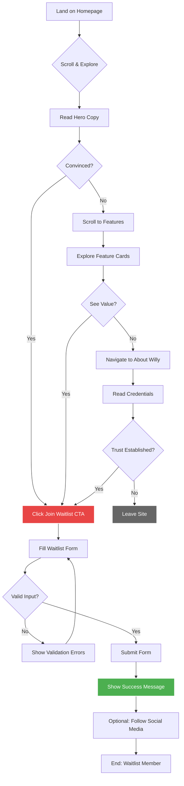
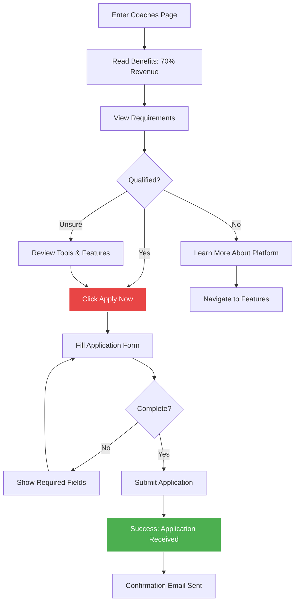

# The Skate Workshop UI/UX Specification - Premium Redesign

**Document Version:** 1.0
**Created:** 2025-10-16
**Status:** Ready for Implementation

---

## Introduction

This document defines the user experience goals, information architecture, user flows, and visual design specifications for **The Skate Workshop**'s premium user interface redesign. It serves as the foundation for visual design and frontend development, ensuring a cohesive, professional, and user-centered experience that rivals top-tier platforms like CapCut and WhatsApp.

---

## 1. Overall UX Goals & Principles

### Target User Personas

1. **Elite Athletes & Aspiring Pros**
   - Professional and semi-professional skateboarders seeking Olympic-level coaching
   - Ages 1230, highly motivated, performance-driven
   - Need: Detailed analytics, professional progress tracking, credible coaching credentials

2. **Serious Hobbyists**
   - Dedicated skaters who invest in their progression
   - Ages 1035, willing to pay for quality coaching
   - Need: Clear progression system, motivational features, community engagement

3. **Coaches & Trainers**
   - Professional coaches looking for management tools
   - Need: Team oversight, athlete tracking, professional reporting, revenue opportunities

4. **Parents & Guardians**
   - Supporting young athletes' skateboarding journey
   - Need: Progress visibility, safety assurance, value demonstration

### Usability Goals

1. **Instant Credibility** - Within 3 seconds of landing, visitors understand the Olympic-level expertise
2. **Effortless Exploration** - Users can discover all key features without overwhelming cognitive load
3. **Premium Feel** - Every interaction feels polished, smooth, and intentional
4. **Clear Action Paths** - Users always know what to do next (join waitlist, learn more, apply as coach)
5. **Mobile-First Excellence** - Flawless experience across all device sizes

### Design Principles

1. **Authority Through Elegance** - Premium design communicates world-class expertise without being flashy
2. **Progressive Disclosure** - Show the most compelling information first, reveal depth as users engage
3. **Motion With Purpose** - Every animation serves to guide attention or provide feedback
4. **Accessibility as Standard** - WCAG 2.1 AA minimum, designed for all users
5. **Performance First** - Fast loading, smooth interactions, optimized assets

---

## 2. Information Architecture (IA)

### Site Map / Screen Inventory

```mermaid
graph TD
    A[Homepage] --> B[About Willy]
    A --> C[Features]
    A --> D[Pricing]
    A --> E[Download/Waitlist]
    A --> F[Coaches]
    A --> G[Contact]

    B --> B1[Biography]
    B --> B2[Credentials]
    B --> B3[Success Stories]

    C --> C1[Video Analysis]
    C --> C2[Session Tracking]
    C --> C3[Trick Database]
    C --> C4[Skate Warz]
    C --> C5[Progress Analytics]

    D --> D1[Athlete Plans]
    D --> D2[Coach Network]
    D --> D3[Enterprise/Teams]

    E --> E1[iOS Download]
    E --> E2[Android Download]
    E --> E3[Waitlist Form]

    F --> F1[Coach Benefits]
    F --> F2[Application Form]
    F --> F3[Requirements]

    G --> G1[Support]
    G --> G2[Business Inquiries]

    A --> H[Legal]
    H --> H1[Privacy Policy]
    H --> H2[Terms of Service]

    style A fill:#E84545,stroke:#fff,stroke-width:3px,color:#fff
    style E fill:#D13939,stroke:#fff,stroke-width:2px,color:#fff
    style F fill:#D13939,stroke:#fff,stroke-width:2px,color:#fff
```



### Navigation Structure

**Primary Navigation:**
- Fixed header navigation with logo, main links (About Willy, Features, Pricing, Coaches)
- Prominent CTA button: "Join Waitlist" (always visible, sticky behavior)
- Mobile: Hamburger menu with smooth slide-in animation

**Secondary Navigation:**
- Footer contains legal links, social media, ecosystem links (Willy's Workshop, Skate Warz, etc.)
- In-page anchor navigation for long-form pages (Features page with section jump links)

**Breadcrumb Strategy:**
- Not needed for current simple hierarchy
- Consider for future app documentation or help center sections

---

## 3. User Flows

### Flow 1: First-Time Visitor → Waitlist Signup

**User Goal:** Understand the value proposition and join the waitlist with minimal friction

**Entry Points:**
- Homepage hero section
- Features page after exploring
- About Willy page after learning credentials
- Direct traffic from social media

**Success Criteria:** User submits email to waitlist form and receives confirmation

#### Flow Diagram



#### Edge Cases & Error Handling:

- **Already on waitlist:** Show friendly message "You're already on the list! Check your email for updates."
- **Invalid email format:** Real-time validation with helpful error message
- **Server error on submit:** Graceful error state with retry button
- **Slow connection:** Loading state with spinner during form submission
- **Privacy concerns:** Link to privacy policy visible near form

---

### Flow 2: Coach Discovery → Application

**User Goal:** Learn about coach opportunities and submit application

**Entry Points:**
- Homepage "Join Willy's Coaching Network" CTA
- Main navigation "Coaches" link
- Direct link from Instagram/social media

**Success Criteria:** User submits complete coach application form

#### Flow Diagram



---

### Flow 3: Feature Explorer → Educated User

**User Goal:** Understand all platform features to make informed waitlist decision

**Entry Points:**
- Homepage "Explore All Features" link
- Main navigation "Features"
- Scroll-triggered feature cards on homepage

**Success Criteria:** User views key features and proceeds to waitlist or shares with others

---

## 4. Component Library / Design System

### Design System Approach

**Strategy:** Create a custom design system built on Tailwind CSS foundation with premium component library

**Structure:**
- Base tokens (colors, spacing, typography) in Tailwind config
- Compound components in `/src/components/ui/`
- Complex patterns in `/src/components/sections/`

### Core Components

#### 1. Button (Premium)
- **Variants:** primary, secondary, ghost, magnetic
- **States:** Default, Hover, Active, Focus, Disabled, Loading
- **Features:** Ripple effect, scale transform, loading spinner, keyboard accessible

#### 2. FeatureCard (3D Interactive)
- **Variants:** default, highlighted, compact
- **Features:** 3D tilt following cursor, glassmorphic background, icon animation, modal integration

#### 3. GradientText
- **Variants:** primary, rainbow, shimmer
- **Features:** Animated gradient, shimmer overlay, responsive sizing

#### 4. GlassCard
- **Variants:** light, dark, colored
- **Features:** Backdrop blur, semi-transparent background, gradient border, noise texture overlay

#### 5. AnimatedCounter
- **Variants:** default, percentage, currency
- **Features:** Scroll-triggered animation, easing curves, prefix/suffix support

#### 6. NavigationMenu (Premium)
- **Variants:** default, minimal, mobile
- **Features:** Shrinks on scroll, glassmorphic background, progress indicator, sticky CTA

#### 7. ScrollReveal
- **Variants:** fade, slide-up, slide-left, scale, stagger
- **Features:** Intersection Observer, configurable threshold, respects reduced motion

#### 8. WaitlistForm (Premium)
- **Variants:** inline, modal, embedded
- **Features:** Real-time validation, loading states, confetti animation, trust signals

---

## 5. Branding & Style Guide

### Color Palette

| Color Type | Hex Code | Usage |
|------------|----------|-------|
| **Primary** | `#E84545` | Primary CTAs, brand emphasis, active states |
| **Primary Dark** | `#D13939` | Hover states, pressed buttons, darker sections |
| **Primary Light** | `#FF5555` | Accents, highlights, subtle emphasis |
| **Background** | `#000000` | Main background, creates premium contrast |
| **Surface** | `#0A0A0A` | Card backgrounds, elevated surfaces |
| **Success** | `#4CAF50` | Success messages, positive feedback |
| **Warning** | `#FF9800` | Warnings, important notices |
| **Error** | `#F44336` | Error states, validation errors |
| **Neutral 400** | `#9CA3AF` | Placeholder text, disabled states |
| **Neutral 800** | `#1F2937` | Borders, dividers |

**Gradients:**
```css
/* Primary Brand Gradient */
background: linear-gradient(135deg, #E84545 0%, #D13939 100%);

/* Premium Glow Gradient */
background: linear-gradient(135deg, #E84545 0%, #FF5555 50%, #D13939 100%);
```

### Typography

**Font Families:**
- Primary: Inter
- Display (optional): Montserrat or Outfit for major headlines
- Monospace: SF Mono, Monaco, Cascadia Code

**Type Scale:**

| Element | Size | Weight | Line Height |
|---------|------|--------|-------------|
| **Display** | `clamp(3.5rem, 8vw, 7rem)` | 800 | 1.1 |
| **H1** | `clamp(2.5rem, 5vw, 4rem)` | 700 | 1.2 |
| **H2** | `clamp(2rem, 4vw, 3rem)` | 700 | 1.3 |
| **H3** | `clamp(1.5rem, 3vw, 2rem)` | 600 | 1.4 |
| **Body** | `1rem` (16px) | 400 | 1.6 |

### Iconography

**Icon Library:** Lucide React
- Size Standard: 20px (default), 24px (large), 16px (small)
- Stroke Width: 2px
- Color: Inherit from parent

### Spacing & Layout

**Grid System:** 12-column responsive grid, max-width 1280px

**Spacing Scale:** 4px, 8px, 12px, 16px, 24px, 32px, 48px, 64px, 96px, 128px

**Section Padding:**
- Mobile: 48-64px vertical
- Desktop: 80-128px vertical

---

## 6. Accessibility Requirements

### Compliance Target

**Standard:** WCAG 2.1 Level AA

### Key Requirements

**Visual:**
- Color contrast: 4.5:1 for normal text, 3:1 for large text
- Focus indicators: 2px solid outline, high contrast
- Text sizing: 16px minimum, zoom to 200% without breaking

**Interaction:**
- Keyboard navigation: Logical tab order, skip links, arrow keys for components
- Screen reader support: Semantic HTML, ARIA labels, proper heading hierarchy
- Touch targets: 44×44px minimum

**Content:**
- Alt text for all meaningful images
- Proper heading structure (h1 → h2 → h3)
- Form labels associated with inputs

### Testing Strategy

- **Automated:** axe DevTools, Lighthouse, Pa11y CI
- **Manual:** Keyboard navigation, screen reader testing (NVDA, JAWS, VoiceOver)
- **User Testing:** Include users with disabilities

---

## 7. Responsiveness Strategy

### Breakpoints

| Breakpoint | Min Width | Max Width | Target Devices |
|------------|-----------|-----------|----------------|
| **Mobile** | `0px` | `767px` | Phones |
| **Tablet** | `768px` | `1023px` | Tablets |
| **Desktop** | `1024px` | `1439px` | Laptops |
| **Wide** | `1440px` | - | Large monitors |

### Adaptation Patterns

**Layout Changes:**
- 3-column desktop → 2-column tablet → 1-column mobile
- Hero stacks vertically on mobile
- Max-width 1280px on all screen sizes

**Navigation Changes:**
- Mobile: Hamburger menu, full-screen slide-in
- Desktop: Full horizontal navigation with all links visible

**Content Priority:**
- Mobile-first content strategy
- Progressive enhancement for desktop (parallax, 3D effects)

---

## 8. Animation & Micro-interactions

### Motion Principles

1. **Purposeful Motion** - Every animation serves a function
2. **Subtle & Sophisticated** - Enhances without distracting
3. **Performance First** - 60fps minimum
4. **Respectful of Preferences** - Honor prefers-reduced-motion
5. **Consistent Timing** - Use design system easing curves

**Duration Guidelines:**
- Micro-interactions: 150-250ms
- Component transitions: 300-500ms
- Page transitions: 400-600ms
- Scroll reveals: 600-800ms

### Key Animations

1. **Hero Text Stagger Reveal** - 800ms, words fade in sequentially
2. **Button Magnetic Effect** - Cursor-following (desktop only)
3. **Card Hover Lift** - 200ms, translateY(-8px) + shadow
4. **Scroll Progress Indicator** - Real-time page progress
5. **Form Input Focus Glow** - 200ms border + shadow transition
6. **Success Confetti Burst** - 2s particle animation
7. **Navigation Shrink on Scroll** - 300ms height transition
8. **Scroll-Triggered Section Reveal** - 600ms fade + slide
9. **Staggered Feature Cards** - 100ms delay between cards
10. **Loading → Success Morph** - 400ms button state change
11. **Glassmorphic Modal Backdrop** - 300ms blur transition
12. **Number Counter Animation** - 2s count-up with easing

---

## 9. Performance Considerations

### Performance Goals

- **LCP (Largest Contentful Paint):** < 2.5s on 4G
- **FID (First Input Delay):** < 100ms
- **Animation FPS:** Consistent 60fps
- **TTI (Time to Interactive):** < 3.5s on mobile
- **CLS (Cumulative Layout Shift):** < 0.1

### Optimization Strategies

1. **Image Optimization:** Next.js Image component, WebP/AVIF, lazy loading
2. **Code Splitting:** Lazy load components, route-based splitting
3. **Animation Performance:** CSS transforms only, GPU acceleration
4. **Font Loading:** next/font with font-display: swap
5. **JavaScript Reduction:** Server Components where possible
6. **Prefetching:** Automatic Next.js link prefetching
7. **Glassmorphism Limits:** Backdrop-filter on static elements only
8. **Third-Party Scripts:** Async loading with Next.js Script component
9. **Monitoring:** Vercel Analytics, Lighthouse CI, performance budgets

---

## 10. Next Steps

### Immediate Actions

1. Review and approve this UI/UX specification with stakeholders
2. Create Figma design files for key screens
3. Set up component library foundation in codebase
4. Audit and extend Tailwind config with design tokens
5. Install dependencies: lucide-react, canvas-confetti
6. Begin implementation with Navigation and Hero section

### Implementation Priorities

**Phase 1: Foundation (Week 1-2)**
- Update Tailwind config
- Build core components
- Premium Navigation
- Animation system setup

**Phase 2: Hero & Landing (Week 2-3)**
- Homepage hero with animations
- Premium waitlist form
- Feature cards with 3D effects

**Phase 3: Feature Showcase (Week 3-4)**
- Interactive FeatureCard components
- Scroll-triggered reveals
- About Willy timeline

**Phase 4: Polish & Performance (Week 4-5)**
- Image optimization
- Animation fine-tuning
- Accessibility audit
- Performance testing

**Phase 5: Testing & Launch (Week 5-6)**
- Cross-browser testing
- Mobile device testing
- Lighthouse audits
- Final stakeholder review

---

**Document Status:** ✅ Complete and ready for implementation
